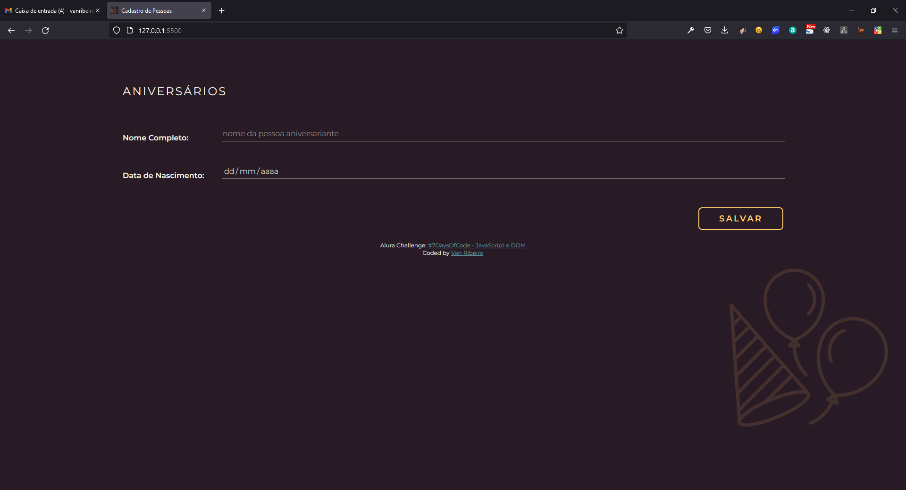

# Alura Challenge - #7DaysOfCode: JavaScript e DOM

## Conteúdo

1. [Desafio](#desafio)
2. [Roteiro](#roteiro):
    1. [Dia 01](#dia-01)
    2. [Dia 02](#dia-02)
    3. [Dia 03](#dia-03)
    4. [Dia 04](#dia-04)
    5. [Dia 05](#dia-05)
    6. [Dia 06](#dia-06)
    7. [Dia 07](#dia-07)

## Desafio

**Desafio**: consiste em fazer criar uma página web que permitirá Adicionar, Alterar, Exibir e Deletar uma pessoa do cadastro de aniversariantes, compondo assim um CRUD(*Create, Read, Update and Delete*).

A página deve conter 01 título e 01 formulário com 01 campo para nome e outro para data de nascimento.

Não possuí um design/layout específico, portanto fica a critério do desafiado.

O desafio é encaminhado por e-mail durante os 07 dias do desafio.

## Roteiro

Roteiro, de acordo com a [página oficial](https://7daysofcode.io/matricula/javascript-e-dom):

### Dia 01

> "Já no primeiro dia, você irá preparar a estrutura base da sua aplicação, criando um formulário básico, vinculando seu evento de submissão a uma função no JavaScript e percorrendo a árvore do DOM para capturar os elementos inseridos e imprimi-los."

### Dia 02
> "Aqui você fará seu formulário obeceder algumas regras de negócios, criando um conjunto mínimo de validações para os dados inseridos."

### Dia 03
> "Nesse dia você irá pegar os dados informados nos campos do seu formulário, criar um objeto representando uma pessoa, persistir esses dados localmente e montar uma tabela para exibi-los."

### Dia 04
> "O seu desafio nesse dia será adicionar uma funcionalidade de edição que torne possível alterar os dados das pessoas, para realizar possíveis mudanças ou correções."

### Dia 05
> "Nesse dia, o seu desafio será criar uma funcionalidade de remoção, com a qual você possa remover uma determinada pessoa da sua persistência física e da tabela de exibição."

### Dia 06
> "Chegando quase no final, você desenvolverá a parte visual do projeto. Você irá aplicar estilos visuais visando tornar a experiência e visual do sistema mais bonito e agradável de se utilizar."

### Dia 07
> "No sétimo e último dia do desafio, você irá tornar a sua aplicação disponível de forma pública na internet. A sua tarefa será hospedar a sua página na nuvem, para que outras pessoas possam acessá-la e ela se torne acessível como um portfólio. Você irá fechar com chave de ouro!"